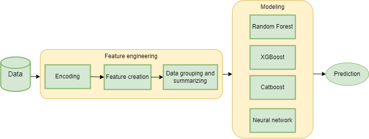

## Credit-risk-management-project-2024
A credit risk-management model was created within the framework of the project.  The model provides binary classification of clients and its objective is to predict whether a client will be defaulted on a loan. 
The project involves data analysis, data cleaning, feature engineering, and the selection of the best performing model.

This repository provides the used code in an aggregated form (model.ipynb), the required requirements (requirements.txt), the code that collected results of the data investigation (credit modeling.ipynb), data description file (data description.txt) and an additional overview picture (Diagram.png).

## Reproducing a project
To reproduce this project follow these steps:
+	Install the required python packages specified in requirements.txt.
+	Download the data (unzip it) and file with targets [from disk](https://drive.google.com/drive/folders/17uiNBmPd58pDlbxQNdbkYOzpYVJK9L8v?usp=sharing).
+	Add the specific paths to the data in the  model.ipynb file.
+	Run the model.ipynb file.

## Methodology

The initial data is represented by 12 .parquet format files. The first step was to merge them into one dataset. The dataset contains information about 3 million customers and their credit history. In total, the dataset contains data on 26 million loans. Each line contains information about one credit product of one client by 61 indicators, such as: serial number of the credit product in the credit history, number of days from the date of credit information confirmation to the date of data collection/closing date, number of overdue loans up to 5 days/from 5 to 30 days/from 30 to 60 days/from 60 to 90 days/more than 90 days and others (full description of all variables is available in the data description.txt).

From 60 variables, 49 are encoded (with no information to enable decoding), 10 are binary and 1 is continuous. Since the data of 49 features is encoded, they are interpreted as categories and have been encoded again. The dataset was grouped based on the id column and a summation of the grouped data was conducted. After that, a new variable max_rn that expresses the maximum number of credit products per customer was generated. Also, a column with targets contained in another file has been added.

The best model and hyper parameter selection was performed (more details about model selection and its tuning can be found in the file credit risk management modeling.ipynb). The code outputs the calculation of the metric and saves the model in pickle format.

## Workflow diagram

